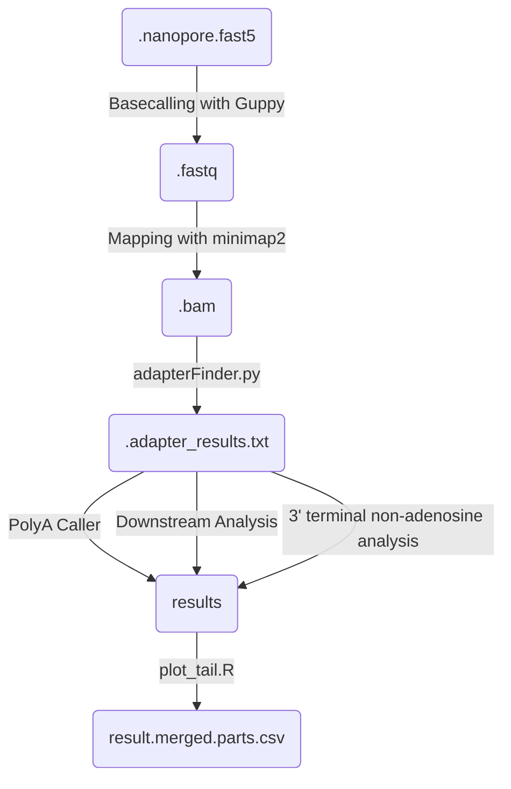

# FLEPseq2

## Description

Snakemake pipelines for polyA detection via FLEPseq2

These snakemakes regroup the major steps described in the FLEPSeq2 github repository (https://github.com/ZhaiLab-SUSTech/FLEPSeq). 
We added an extra step (extract_tails.py) to extract the additionnal tail after the polyA, and analyse its composition and a downstream analysis for graph generation.

Some minor changes have been done to the original FLEPSeq2 code:
- Handling directly FASTQ files without needing to convert them to FASTA

Steps of the workflow

## Data Preparation

the fastq files of each sample (genotype) have to be concatenated in the output directory:
```bash
mkdir -p ~/DATA/FLEPseq/RUN11_F/1_Runs

cat barcode12/*.fastq.gz > ~/DATA/FLEPseq/RUN11_F/1_Runs/barcode12.fastq.gz
cat barcode13/*.fastq.gz > ~/DATA/FLEPseq/RUN11_F/1_Runs/barcode13.fastq.gz
cat barcode14/*.fastq.gz > ~/DATA/FLEPseq/RUN11_F/1_Runs/barcode14.fastq.gz
```

A barcode correspondance file (tab separated) is required and looks as follows:

|  |  |
| ----------- | ------------|
| barcode12   | WT          |
| barcode13   | mut1        |
| barcode14   | mut2        |

The first line will be the reference for statistical tests.

## Getting started

Clone the repository

```bash
git clone https://github.com/jackson-peter/FLEPseq2.git
```

A configuration file (.yaml) is required to run the workflow. An example is included in the FLEPseq2/config folder. You can modify it to suit your data.
```yaml
### EXPERIMENT SPECIFIC 
basecalled_dir: "/ssd_workspace/jpeter/ssData/Guppy_basecalling/RUN12_Rep18_GS/workspace/" # Path to fast5 files
outdir: "/home/jpeter/DATA/FLEPseq/RUN12_GS"
barcode_corr: "/home/jpeter/DATA/FLEPseq/RUN12_GS/barcode_correspondance.tsv"
sequencing_summary: "/home/jpeter/DATA/FLEPseq/RUN12_GS/sequencing_summary.txt"

### OUTPUT FILES ORGANIZATION
runs_dir: "1_Runs"
mapping_dir: "2_Mapping"
polyA_dir: "3_PolyA"
tail_dir: "4_Tail"

### ANNOTATIONS
introns_exons: "/home/jpeter/DATA/ReferenceGenomes/Athaliana/TAIR10/exon_intron_pos.repr.bed"
select_introns: "/home/jpeter/DATA/ReferenceGenomes/Athaliana/TAIR10/select_introns.txt"
reference_genome: "/home/jpeter/DATA/ReferenceGenomes/Athaliana/TAIR10/TAIR10_chr_all.fas" # Reference genome in fasta

### MINIMAP MAPPING ADDITIONAL PARAMETERS
minimap2_add_opts: "--secondary=no -G 5000"

```

## Usage

To run the whole pipeline, just execute the runFLEPseq.sh file containing the snakemakes commands
```bash
conda activate snakemake # or mamba activate snakemake if it is installed
# Go in the 'workflow' folder where the Snakefile is 
cd FLEPseq2/workflow
bash runFLEPseq.sh
```

## Requirements

The only requirement to run the snakefiles is:
- snakemake (>=7)

The other requirements will be handled directly by snakemake with the --use-conda option. This will automatically set up an environement containing all the requirements for the pipeline's execution.


## Usefull links

- Research article describing FLEPSeq2: https://www.nature.com/articles/s41596-021-00581-7
